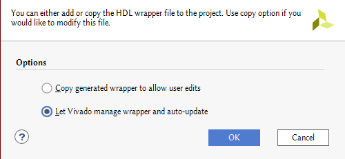

# Vivado + PYNQ Anleitung
Bei allen übersprungenen Schritten sind die defaults auszuwählen.

## PYNQ board files:
- [PYNQ board files](https://github.com/cathalmccabe/pynq-z1_board_files) herunterladen
- in die Vivado installation/2020.1/data/boards/board_files entzippen
    - z.B. /opt/Xilinx/Vivado/2020.1/data/boards/board_files

## Neues Projekt:
- In Vivado ein neues RTL Projekt erstellen

- Sources hinzufügen - add files - alle VHDL sources auswählen, die man im Projekt braucht
- Bei target language VHDL auswählen

- Bei Board PYNQ-Z1 auswählen

## AXI Lite Interface:
### Erstellen:
- Tools -> Create and Package new IP...
- Create a new AXI4 peripheral

- Select number of Registers

- Edit IP

### Bearbeiten:
- Öffne die AXIlite Schnittstelle (liegt in ip_repo/[AXI_name]) in deienem Texteditor der Wahl.

- In [IPname].vhd bei port, der component [IPname]_S00_AXI und in der port map die Pins hinzufügen.

- In [IPname]_S00_AXI.vhd bei port die Pins hinzufügen & die Logik verändern

    - Außgänge können kombinatorisch mit einem bit der Register verbunden werden.
    
    - Bei eingängen müssen wir uns in die Logik des generierten VHDLs einhängen.
    Das machen wir etwas weiter oben, wenn eigentlich der Register gelesen werden soll, den wir dann überschreiben.

### re-packageing:
- In dem edit IP Fenster von Vivado bei Ports and Interfaces "Merge changes from Ports and Interfaces Wizard" klicken.

- In Review and Package ganz unten auf "Re-Package IP" klicken

## Block design:
- Ein neues Block design erstellen

- Das ZYNQ7 Processing System hinzufügen:
    - rechtsklick -> ZYNQ7 Processing System auswählen
- Run Block Automation

- Das AXI Lite Interface auf die gleiche Weise hinzufügen ( heißt vermutlich myip)
- Run Connection Automation

- Nun können die eigenen Module importiert werden:
    - rechtsklick -> add Module -> das zu importierende Modul auswählen
- Dann per drag & drop die Pins des Moduls mit dem AXI Lite Interfaces verbinden.

Das fertige Block Design sollte dann in etwa so aussehen:

- Speichen nicht vergessen!

- Jetzt müssen wir unser Block Design als top level setzen, dafür muss dieses aber in ein VHD wrapper gewrappt werden.
- Also wählen wir unser Block Design in den sources aus

- Dann rechtsklicken wir und wählen create HDL Wrapper aus

- Um dann diesen Wrapper als top in seinem Rechtsklickmenü auszuwählen

## Generate Bitstream
- Der nächste Schritt ist Vivado den Bitstream generieren zu lassen, der dann auf den ZYNQ hochgeladen wird

## Upload to PYNQ
### Mit dem PYNQ verbinden
- Mit dem gsg VPN verbinden
#### Uni GSG VPN
- SSH Tunnel aufbauen: `ssh -D8888 login.cs.uni-bonn.de`

- [b-it User Management Interface](https://nic1.bit.uni-bonn.de/)
    - Neues Zertifikat erstellen & herunterladen
    - 
- `sudo openvpn /[Pfad]/sabatsch-openvpn-udp.ovpn`
#### Verbindung zum Labor
- ssh -L 9090:pynq:9090 -N [gsg username]@TiLab[6 oder 7].informatik.uni-bonn.de
- browser auf localhost:9090 öffnen

- login mit passwort xilinx
- Einen Ordner erstellen, um die Dateien zu verwalten

- Den Ordner umbenennen

- Aus [projektName]/[projektName].srcs/bd/[designName]/hw_handoff die hwh datei hochladen
    - tcl sollte eigentlich auch funktionieren tut es aber nicht.

- Aus [projektName]/[projektName].runs/[implementationName] die bit datei hochladen

- Beide Dateien müssen gleich heißen

- Eine neue Python3 Datei erstellen
- PYNQ importieren: `from pynq import Overlay`
- Overlay hochladen: `overlay = Overlay('Johnson.bit')`
- Informationen über das Overlay anschauen: `overlay?`

- unter IP Blocks sollte nun unser AXI Lite Interface zu sehen sein.
- Auf dieses kann man nun wie folgt zugreifen:

- Die Adresse, die als Argument angegeben wird ist das Register auf dem AXI Lite interface.
- Die Daten beim Schreiben sind immer 32 bits.

